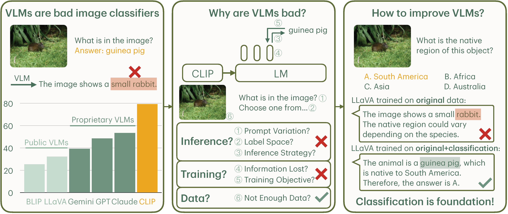

# Why are Visually-Grounded Language Models Bad at Image Classification?

[](https://lbesson.mit-license.org/)
[](https://www.python.org/downloads/release/python-311/)
[](https://pytorch.org/get-started/previous-versions/#v21)
[](https://github.com/ambv/black)

This repo provides the PyTorch source code of our paper: [Why are Visually-Grounded Language Models Bad at Image Classification?](https://arxiv.org/abs/2405.18415) (NeurIPS 2024). Check out project page [here](https://yuhui-zh15.github.io/VLMClassifier-Website/)!

## 🔮 Abstract

Image classification is one of the most fundamental capabilities of machine vision intelligence. In this work, we revisit the image classification task using visually-grounded language models (VLMs) such as GPT-4V and LLaVA. We find that existing proprietary and public VLMs, despite often using CLIP as a vision encoder and having many more parameters, significantly underperform CLIP on standard image classification benchmarks like ImageNet. To understand the reason, we explore several hypotheses concerning the inference algorithms, training objectives, and data processing in VLMs. Our analysis reveals that the primary cause is data-related: critical information for image classification is encoded in the VLM's latent space but can only be effectively decoded with enough training data. Specifically, there is a strong correlation between the frequency of class exposure during VLM training and instruction-tuning and the VLM's performance on those classes; when trained with sufficient data, VLMs can match the accuracy of state-of-the-art classification models. Based on these findings, we enhance a VLM by integrating classification-focused datasets into its training, and demonstrate that the enhanced classification performance of the VLM transfers to its general capabilities, resulting in an improvement of 11.8% on the newly collected ImageWikiQA dataset.

</img>

## 🚀 Getting Started

Please install the required packages:

- Inference-based environment: [vlmhf.yml](./vlmhf.yml)
- Training-based environment: [llava.yml](./llava.yml) for LLaVA and [lavis.yml](./lavis.yml) for BLIP

## 📄 Reproduce Paper Results

Please look at script files in each folder to reproduce the results in the paper:

- Section 2 (VLMs are Bad at Image Classification): [main_results](./main_results/)
- Section 3 (Why are VLMs Bad Image Classifiers): [inference_analysis](./inference_analysis/), [feature_analysis](./feature_analysis/), [data_analysis](./data_analysis/), [training_analysis](./training_analysis/) (**⚠️ we provide trained model checkpoints [here](https://drive.google.com/drive/folders/18KduIFfcEOwWy-qgU4imQE_0xxUPjro9?usp=sharing)**)
- Section 4 (Improving VLM with Classification Data): [imagewikiqa](./imagewikiqa/)

Whatever scripts you run, if you run into `package not found` errors, make sure to run `pip install` on the corresponding package.

### 💎 Dataset: ImageWikiQA

Dataset is available at [here](./data/imagewikiqa.jsonl). Corresponding images can be downloaded [here](https://drive.google.com/drive/folders/18KduIFfcEOwWy-qgU4imQE_0xxUPjro9?usp=sharing).


## Getting ImageWikiQA Inference to Work

<!--Download this [zip file](https://drive.google.com/file/d/1VXG2H2h8JeRYqBoT7n3E7h4DMso6yric/view?usp=sharing), and unzip it in `VLMClassifier/training_analysis/llava`.-->
Follow the instructions here to download the LLaVA library into this project: https://github.com/haotian-liu/LLaVA/blob/main/README.md.

Modify the paths in `eval_imagewikiqa.sh` to your own preference, following a similar folder structure/format to what I did. Here's some documentation on what the main individual tags do:

1. `--model-path`: path to a local or HuggingFace model. For the HuggingFace base LLaVA model, use this path: `/home/huggingface/liuhaotian/llava-v1.5-7b`.
2. `--question-file`: where your ImageWikiQA JSON data is located. Usually should be under `VLMClassifier/data/imagewikiqa.jsonl`, but make sure to use the absolute path.
3. `--image-folder`: where the ImageWikiQA images are stored. Just use the absolute path to your repo.
4. `--answers-file`: place to store the outputs of your model (auto-generated by the script, so don't worry if it doesn't exist yet).

### Base LLaVA Model (DO FIRST BEFORE THE SECTION BELOW)

1. In the `VLMClassifier/training_analysis/llava` folder, run `./eval_imagewikiqa.sh` directly, passing in `/home/huggingface/liuhaotian/llava-v1.5-7b` to `--model-path`.
2. In `eval_imagewikiqa.ipynb`, modify the file path of the output in the second cell, then run all the cells.

### Fine-tuned LLaVA Model on ImageNet (DO THE BASE MODEL FIRST)

A couple more steps:

1. Download the `imagenet_and_llava_mm_projector.bin` found [here](https://drive.google.com/file/d/10yJi4EHiPyH9HeW4_f22Fv49KPqpxy_p/view?usp=drive_link), and put it in `VLMClassifier/training_analysis/llava/checkpoints` (you'll need to manually create the checkpoints folder first). This file holds state info of an already-tuned model on the ImageNet and LLaVA fine-tuning datasets, which you'll need to merge into an original LLaVA model (i.e. the one from the previous section).
2. You'll need to run the `VLMClassifier/training_analysis/llava/process_model.ipynb` file to merge the model state file into LLaVA. Follow the **TODO** comment there to modify the path to your original LLaVA model, then run all the cells in that notebook.
3. In `eval_imagewikiqa.sh`, pass in the folder to your model (`...VLMClassifier/training_analysis/llava/processed-llava-v1.5-7b-imagenet` by default) to `--model-path` before running the bash script in the terminal.
4. In `eval_imagewikiqa.ipynb`, modify the file path of the output in the second cell, then run all the cells.


## Inference on Other Datasets

In `VLMClassifier/training_analysis/llava`, there is a file called `eval_data.sh` that you can run to evaluate LLaVA on Ai2D, TextVQA, and DocVQA. In that file, uncomment the respective script before running `eval_data.sh`.


## 🎯 Citation

If you use this repo in your research, please cite it as follows:
```
@article{VLMClassifier,
  title={Why are Visually-Grounded Language Models Bad at Image Classification?},
  author={Zhang, Yuhui and Unell, Alyssa and Wang, Xiaohan and Ghosh, Dhruba and Su, Yuchang and Schmidt, Ludwig and Yeung-Levy, Serena},
  journal={Conference on Neural Information Processing Systems (NeurIPS)},
  year={2024}
}
```
